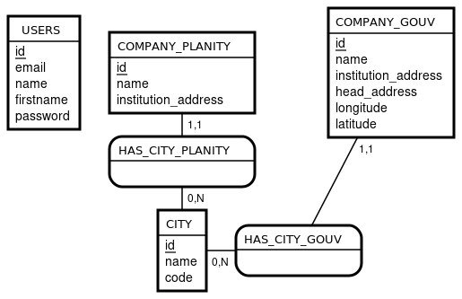
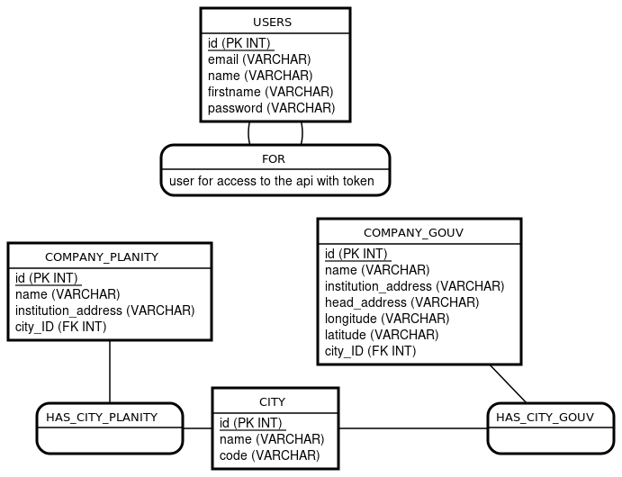

# rendu_bloc_1

## Description
Ce projet combine du web scraping,des requêtes api, requêtes SPARQL sur Wikidata, et une API REST développée avec FastAPI. Il utilise plusieurs bibliothèques pour automatiser des tâches de scraping, traiter des données. le but et de pouvoir trouver des salons de coiffure qui n'est pas chez une application concurente pour le démarchage.

## Dépendances
Les principales dépendances du projet sont :

- **FastAPI** : Framework pour créer l'API.
- **uvicorn** : Serveur ASGI pour exécuter l'application FastAPI.
- **selenium** : Pour l'automatisation de navigateur et le scraping.
- **beautifulsoup4** : Pour parser et extraire des informations depuis le HTML.
- **pandas** : Pour la manipulation et l'analyse de données.
- **requests** : Pour effectuer des requêtes HTTP.
- **python-dotenv** : Pour charger les variables d'environnement depuis un fichier `.env`.
- **pymysql** : Pour se connecter à une base de données MySQL.
- **pymongo** : Pour se connecter à une base de données MongoDB.
- **PyJWT** : Pour créer et gérer les tokens JWT.
- **passlib** : Pour hacher et vérifier les mots de passe.
- **pydantic** : Pour la validation et la gestion des données (utilisé par FastAPI).
- **SPARQLWrapper** : Pour interroger le service SPARQL de Wikidata.
- **crontab** : Pour planifier l'exécution régulière de scripts (la configuration se fait côté système).

## Installation

Il est recommandé d'utiliser un environnement virtuel. Voici comment installer toutes les dépendances avec `pip` :

```bash
# Créer un environnement virtuel (optionnel mais recommandé)
python -m venv venv

# Activer l'environnement virtuel
# Sous Windows :
venv\Scripts\activate
# Sous macOS/Linux :
source venv/bin/activate

# Installer les dépendances
# Installer les dépendances
pip install fastapi uvicorn selenium beautifulsoup4 pandas requests python-dotenv pymysql pymongo pyjwt passlib pydantic SPARQLWrapper webdriver-manager

```


## Structure de la Base de Données

La conception de la base de données a été réalisée à l'aide de [MOCODO](https://mocodo.net/). Vous trouverez ci-dessous deux diagrammes illustrant la structure de la base de données :

### Modèle Conceptuel de Données (MCD)


### Modèle Physique de Données (MPD)


Ces diagrammes offrent une vue détaillée de la structure et de l'organisation de la base de données du projet.

## Création de la Base de Données

Pour initialiser la base de données, vous devez exécuter le script SQL contenu dans le fichier `database.sql`.  
Si vous utilisez MySQL 8, vous pouvez le faire via le client en ligne de commande. Voici la méthode :

Ouvrez une session MySQL en ligne de commande :
   ```bash
mysql -u votre_utilisateur -p

source /chemin/vers/database.sql;
```

## Remplissage de la Base de Données

Pour remplir la base de données avec les informations relatives aux salons de coiffure, lancez le script `bdd_give_data.py`. Ce script effectue les opérations suivantes :

- **Scraping de Planity** :  
  Il scrappe le site Planity pour récupérer la liste des salons de coiffure disponibles à Bordeaux chez eux.

- **Requête de l'API du Gouvernement** :  
  Il interroge l'API [recherche-entreprises.api.gouv.fr](https://recherche-entreprises.api.gouv.fr) afin d'obtenir la liste complète des salons de coiffure recensés sur Bordeaux.

- **Nettoyage et Traitement des Données** :  
  Les données récupérées sont ensuite nettoyées et formatées pour correspondre à la structure attendue par les bases de données.

- **Insertion dans la Base de Données MySQL** :  
  Les salons de coiffure (issus de Planity et de l'API) sont insérés dans la base de données MySQL.

- **Insertion dans la Base de Données MongoDB** :  
  Les entreprises à démarcher sont insérées dans la base de données MongoDB.

### Pré-requis

- **Structure de la base de données** :  
  Assurez-vous d'avoir créé la base de données en exécutant le fichier `database.sql` (voir section correspondante).

- **Variables d'environnement** :  
  Vérifiez que le fichier `.env` est correctement configuré avec les informations de connexion pour MySQL, MongoDB, etc.

## Planification avec Crontab pour l'Export CSV

La commande suivante planifie l'exécution d'un script qui génère un fichier CSV à jour contenant la liste de tous les salons de coiffure disponibles sur Bordeaux tout les jours a 15 h 30 :

```bash
30 15 * * * /usr/bin/python3 /mnt/chemin_vers/crontab_csv.py
```

Ouvrir le terminal WSL :
Lancez le terminal WSL (par exemple, Ubuntu).

Éditer la crontab :
Dans le terminal, tapez :
```bash
crontab -e
```
Ajoutez la ligne de commande indiquer au dessus pour planifier le crontab puis sauvegardez avec ctrl + o et entrer puis fermer avec ctrl + x


## Lancement de l'API

Pour lancer l'API en mode développement, placez-vous dans le dossier `api` de votre projet, puis exécutez la commande suivante :

```bash
fastapi dev main.py
```

## Lancement du Script Wikidata

Le fichier `wikidata.py` peut être lancé pour effectuer une requête SPARQL afin de vérifier le nombre d'habitants de Bordeaux. Ce script envoie une requête à l'endpoint Wikidata et affiche le résultat dans le terminal.

